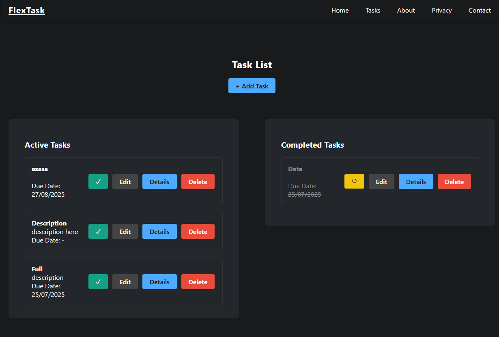
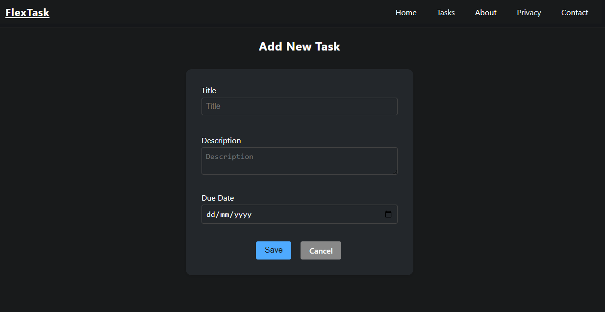
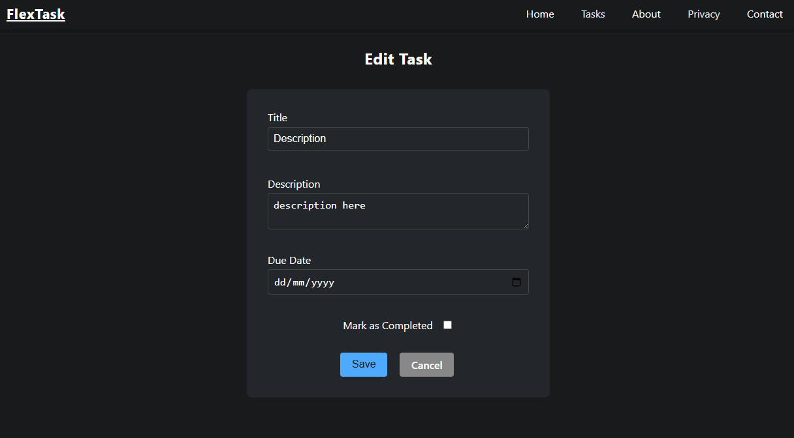

# FlexTask - Modern ASP.NET Core To-Do App


**FlexTask** is a powerful and lightweight web application developed using the **ASP.NET Core MVC** architecture to manage your daily tasks. This project was built with modern software principles.

---

## Features

- **Task Management:** Effortlessly add, remove, edit, or view the details of your tasks.
- **Status Tracking:** Keep your list up to date by marking tasks as completed.
- **Dual Database Structure:**
  - **Task List:** The main database where users interact with their daily tasks.
  - **Contact Info:** A background database for internal information (Restricted from direct site interaction for security purposes).
- **Local Storage:** Data is securely stored in **Microsoft SQL LocalDB** via Entity Framework Core.
- **Responsive UI:** A modern interface fully compatible with all devices, built using HTML5, CSS3, and Bootstrap 5.

---

## 📸 Screenshots

| Task List | Add New Task | Edit Task |
| :---: | :---: | :---: |
|  |  |  |

---

## 🛠️ Technologies Used

This application is built with the following modern tools and libraries:

- **Language:** C# (C-Sharp)
- **Framework:** ASP.NET Core MVC (.NET 9.0)
- **Frontend:** HTML5, CSS3, JavaScript, Bootstrap 5
- **ORM:** Entity Framework Core
- **Database:** Microsoft SQL LocalDB (MSSQLLocalDB)
- **Architecture:** MVC (Model-View-Controller)

---

## 🚀 Installation and Running

Follow these steps to run the project on your local machine:

1. Clone this repository:
```
git clone https://github.com/Hexcha/To-do-app.git
```
2. Navigate to the project main directory (FlexTask):
```
cd FlexTask
```
3. Create the database and migrate the tables:
```
dotnet ef database update
```
4. Run the application:
```
dotnet run
```
5. **Accessing the Application:**
After running the command, look for the **"Now listening on:"** line in your terminal. Click the address shown there (e.g., http://localhost:5294) or copy-paste it into your browser to start using the application.

---

## Contributing

1. Fork this project.
2. Create a new Feature Branch.
3. Commit your changes.
4. Push your Branch.
5. Create a Pull Request.

---

**Developer:** [@Hexcha](https://github.com/Hexcha)
-----------------------------------------------------------
**TR**
-----------------------------------------------------------
# FlexTask - Modern ASP.NET Core To-Do App


**FlexTask**, günlük görevlerinizi yönetmek için **ASP.NET Core MVC** mimarisi ile geliştirilmiş, güçlü ve sade bir web uygulamasıdır. Bu proje, Hacettepe ASP.NET Core çalışmaları kapsamında modern yazılım prensipleriyle oluşturulmuştur.

---

## Özellikler

- **Görev Yönetimi:** Görevlerinizi ekleyin (Add), silin (Remove), güncelleyin (Edit) veya detaylarını inceleyin.
- **Durum Kontrolü:** Tamamlanan görevleri işaretleyerek listenizi güncel tutun.
- **Çift Veritabanı Yapısı:**
   - **Task List:** Kullanıcının aktif olarak etkileşime girdiği görev verileri.
   - **Contact Info:** Arka planda tutulan iletişim verileri (Güvenlik gereği site üzerinden doğrudan müdahale kapalıdır).
- **Yerel Depolama:** Veriler **Microsoft SQL LocalDB** üzerinde Entity Framework Core aracılığıyla güvenle saklanır.
- **Responsive UI:** HTML5, CSS3 ve Bootstrap 5 kullanılarak her cihaza uyumlu hale getirilmiş modern arayüz.

---

## Ekran Görüntüleri

| Görev Listesi | Yeni Görev Ekleme | Görev Düzenleme |
| :---: | :---: | :---: |
|  |  |  |


---

## Kullanılan Teknolojiler

Bu uygulama aşağıdaki modern araçlar ve kütüphanelerle inşa edilmiştir:

- **Dil:** C# (C-Sharp)
- **Framework:** ASP.NET Core MVC (.NET 9.0)
- **Frontend:** HTML5, CSS3, JavaScript, Bootstrap 5
- **ORM:** Entity Framework Core
- **Veritabanı:** Microsoft SQL LocalDB (MSSQLLocalDB)
- **Mimari:** MVC (Model-View-Controller)

---

## Kurulum ve Çalıştırma

Projeyi yerel makinenizde çalıştırmak için şu adımları izleyin:

1. Bu depoyu klonlayın:
```
git clone https://github.com/Hexcha/To-do-app.git
```
2. Proje ana dizinine (FlexTask) gidin:
```
cd FlexTask
```
3. Veritabanını oluşturun ve tabloları migrate edin:
```
dotnet ef database update
```
4. Uygulamayı çalıştırın:
```
dotnet run
```

5. Uygulamaya Erişim: 
Komutu çalıştırdıktan sonra terminalde çıkan "Now listening on:" satırındaki adrese (örneğin http://localhost:5294) tıklayarak veya bu adresi tarayıcınıza yapıştırarak uygulamayı kullanmaya başlayabilirsiniz.
---

## Katkıda Bulunma

1. Bu projeyi Fork'layın.
2. Yeni bir Feature Branch oluşturun.
3. Değişikliklerinizi Commit edin.
4. Branch'inizi Push edin.
5. Bir Pull Request oluşturun.

---

**Geliştirici:** [@Hexcha](https://github.com/Hexcha)
=======

